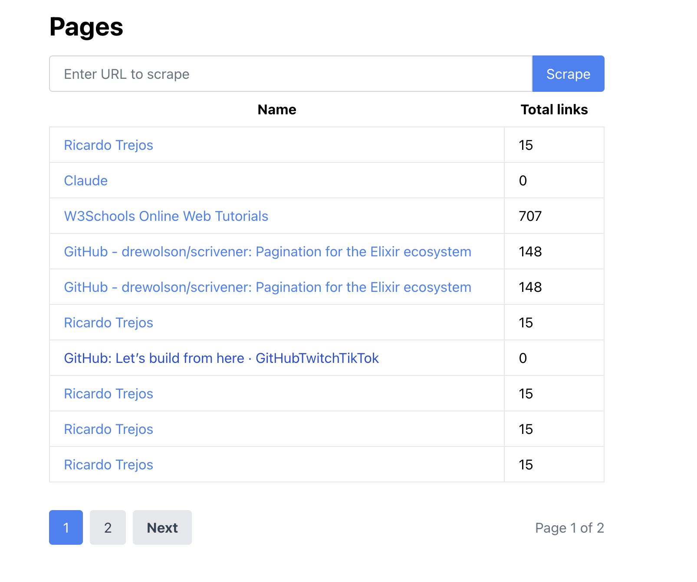
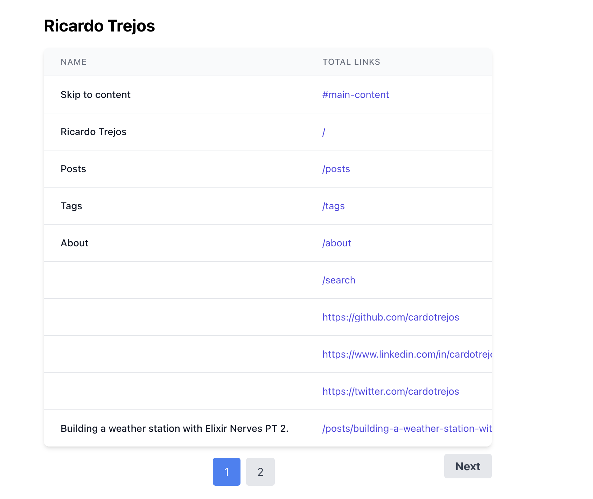

# Hexscraper

Hexscraper is a web application that allows users to scrape web pages and store the extracted links in a database.

## Features

- User registration and authentication (API only)
- Web page scraping functionality (API and LiveView)
- Storing scraped pages and links in a database
- Paginated listing of scraped pages
- Detailed view of a scraped page with its links
- RESTful API endpoints for page creation and retrieval

## Technologies Used

- Elixir
- Phoenix Framework
- PostgreSQL
- Ecto
- LiveView
- Tailwind CSS
- HTTPoison
- Floki

## Getting Started

### Prerequisites

- Elixir 1.12 or higher
- Phoenix 1.6 or higher
- PostgreSQL

### Installation

1. Clone the repository:

   ```shell
   git clone https://github.com/your-username/hexscraper.git
   ```

2. Change into the project directory:
    ```shell
    cd hexscraper
    ```
3. Install dependencies:
    ```shell
    mix deps.get
    ``` 
4. Create and migrate the database:
    ```shell
    mix ecto.setup
    ```
5. Start the Phoenix server:
    ```shell
    mix phx.server
    ```
6. Visit `http://localhost:4000/pages` in your browser to access the application.


## Usage

- Register a new user account or log in with an existing account. (API only)
- Enter a URL in the provided input field and click the "Scrape" button to initiate the scraping process.
- The scraped page will be added to the list of pages.
- Click on a page title to view the details of the scraped page, including its associated links.
- Use the pagination controls to navigate through the list of scraped pages.

## API Endpoints

`POST /api/register`: Register a new user account.
`POST /api/login`: Authenticate and log in a user.
`POST /api/pages`: Create a new scraped page.
`GET /api/pages`: Retrieve a paginated list of scraped pages.
`GET /api/pages/:id`: Retrieve details of a specific scraped page.

## Tools

- LiveView is used for real-time UI updates and server-side rendering.
- Ecto is used as the database wrapper and query builder.
- The scraping functionality is implemented using HTTPoison for making HTTP requests and Floki for parsing HTML.
- Pagination is implemented using the Scrivener library.
- The frontend utilizes Tailwind CSS for styling.

## Possible Improvements

- Implement a job queue for background processing of scraping tasks.
- Enhance error handling and provide more informative error messages.
- Add support for scraping additional data from web pages, such as meta tags and images.
- Implement a search functionality to allow users to search for specific pages or links.
- Implement testing for links and pages scraping functionality, also the pagination.

## Screenshots




